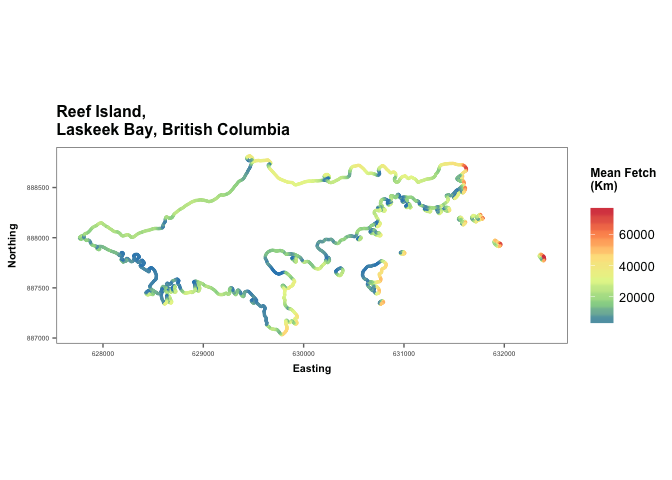

<!-- README.md is generated from README.Rmd. Please edit that file -->
[](https://travis-ci.org/sebdalgarno/HGfetch)

haidawave
=========

Fetch-based wave exposure model.

Introduction
------------

These functions, in conjunction with data available for download from <https://github.com/sebdalgarno/haidawave-data>, are designed to facilitate calculation of wave exposure at sites in Haida Gwaii. Although the user may provide their own fetch and wind data from another region, we recommend checking out the 'waver' package (available on CRAN) for calculating wave exposure elsewhere.

Two methods are provided for calculating fetch-based wave exposure at a set of sites: Mean Fetch and Wind-weighted Fetch. Three data sets are required as inputs: coordinates for a set of sites (supplied by the user), fetch data and wind data. For sites within Laskeek Bay, wind data (Cumshewa Head weather station, 2012-2016) and fetch data are provided within the package. For sites outside of Laskeek Bay but within Haida Gwaii, fetch and wind data may be retrieved by executing the following code (note 6 separate files are downloaded and bound together due to file import size limitations on github):

``` r
library(readr)
# read in and bind fetch data
hg1 <- read_csv("https://raw.githubusercontent.com/sebdalgarno/haidawave-data/master/haidagwaii-fetch-1.csv")
hg2 <- read_csv("https://raw.githubusercontent.com/sebdalgarno/haidawave-data/master/haidagwaii-fetch-2.csv")
hg3 <- read_csv("https://raw.githubusercontent.com/sebdalgarno/haidawave-data/master/haidagwaii-fetch-3.csv")
hg4 <- read_csv("https://raw.githubusercontent.com/sebdalgarno/haidawave-data/master/haidagwaii-fetch-4.csv")
hg5 <- read_csv("https://raw.githubusercontent.com/sebdalgarno/haidawave-data/master/haidagwaii-fetch-5.csv")
hg6 <- read_csv("https://raw.githubusercontent.com/sebdalgarno/haidawave-data/master/haidagwaii-fetch-6.csv")

hgfetch <- rbind(hg1, hg2, hg3, hg4, hg5, hg6)

# read in wind data
hgwind <- read_csv("https://raw.githubusercontent.com/sebdalgarno/haidawave-data/master/wind-hg-1216.csv")
```

Fetch and wind data
-------------------

Points were generated within a GIS spaced 10m along 1:50,000 ShoreZone vector coastline data (Howes et al. 1994). From each point, fetch distance (i.e. distance from point to nearest ShoreZone coastline) was calculated at 5 degree intervals using the java-based software - 'Vector\_fetch' - developed by Mika Murtojarvi (Murtojarvi et al. 2007). Since ShoreZone vector coastline data were limited to BC, fetch distances are only accurate to 200,000 m.

The wind data set comprises hourly wind observations for all weather stations in Haida Gwaii with available data from 2012-2016. These data were taken from <http://climate.weather.gc.ca/historical_data/search_historic_data_e.html>).

References
----------

Murtojarvi, M., T. Suominen, H. Tolvanen, V. Leppanen, and O. S. Nevalainen. 2007. Quantifying distances from points to polygons: applications in determining fetch in coastal environments. Computers & Geosciences 33:843–852.

Howes, D., J. Harper, and E. Owens. 1994. Physical shore-zone mapping system for British Columbia. Resources Inventory Committee Publication 8:71.

Utilisation
-----------

``` r
library(HGfetch)
library(magrittr)
library(ggplot2)
library(ggthemes)
library(RColorBrewer)
library(dplyr)

# load sites, convert data.frame to SpatialPoints, transform projection to BC Albers
data <- data.frame(Long = -131, Lat = 53)
data %<>% convert_proj()

# convert wind data.frame to SpatialPointsDataFrame, transform projection to BC Albers
cumshewa_wind %<>% convert_proj()

# convert fetch data.frame to SpatialPointsDataFrame, maintain projection as BC Albers
laskeek_fetch %<>% convert_proj(data.x = 'Easting', data.y = 'Northing', data.CRS="+init=epsg:3005", new.CRS="+init=epsg:3005")

# find nearest fetch point, calculate mean fetch distance
data %<>% mean_fetch(fetch.data = laskeek_fetch, max.distance = 200000)

# find nearest weather station, calculate weighting factors (avg. speed * % frequency) for each bearing based on user-defined time period and set of stations.
weights <- wind_weights(wind.data = cumshewa_wind, years = 2016, months = 9:4)

# find nearest fetch point, calculate wind-weighted fetch
data %<>% wind_fetch(fetch.data = laskeek_fetch, weights.data = weights, max.distance = 200000)
```

``` r
# plot Mean Fetch and Wind-weighted Fetch results for Reef Island, Laskeek Bay, British Coluumbia
lbsites <- remove.duplicates(laskeek_fetch)

lbsites %<>% mean_fetch(laskeek_fetch)

lbsites %<>% wind_fetch(fetch.data = laskeek_fetch, weights.data = weights)

reef <- as.data.frame(lbsites) %>% subset(Easting > 627000 & Northing < 890000)

# Mean Fetch
ggplot(reef) + geom_point(aes(x = Easting, y = Northing, color = meanfetch), size = 0.5) + coord_fixed() + 
  theme_few() + labs(color = 'Mean Fetch\n(Km)\n', title = 'Reef Island,\nLaskeek Bay, British Columbia') + 
  theme(plot.title = element_text(size = 12, face = 'bold'), axis.title = element_text(size = 8, face = 'bold'), axis.text = element_text(size = 5), legend.title = element_text(size = 9, face = 'bold')) + scale_color_distiller(palette = "Spectral")
```



``` r
# Wind Fetch
ggplot(reef) + geom_point(aes(x = Easting, y = Northing, color = windfetch), size = 0.5) + coord_fixed() + theme_few() + labs(color = 'Wind-weighted Fetch\n(Weighted Km)\n\nWind data:\nNov - Apr, 2016\n', title = 'Reef Island,\nLaskeek Bay, British Columbia') + theme(plot.title = element_text(size = 12, face = 'bold'),axis.title = element_text(size = 8, face = 'bold'), axis.text = element_text(size = 5), legend.title = element_text(size = 9, face = 'bold')) + scale_color_distiller(palette = "Spectral")
```


Installation
------------

To install from GitHub

    # install.packages("devtools")
    devtools::install_github("sebdalgarno/HGfetch")

Contribution
------------

Please report any [issues](https://github.com/sebdalgarno/HGfetch/issues).

[Pull requests](https://github.com/sebdalgarno/HGfetch/pulls) are always welcome.
