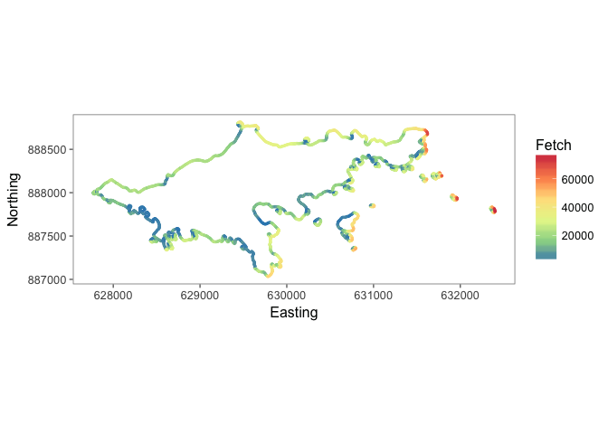
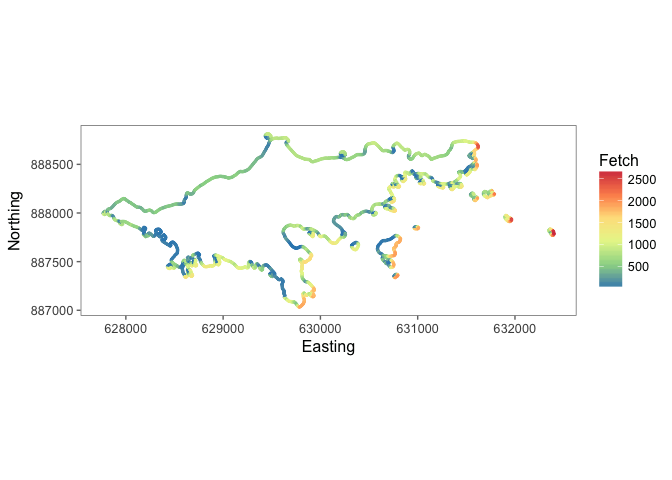

<!-- README.md is generated from README.Rmd. Please edit that file -->
[](https://travis-ci.org/sebdalgarno/HGfetch)

haidawave
=========

Introduction
------------

`haidawave` is as R package to calculate wave exposure (mean fetch) based on fetch and possibly wind data. In addition to the `mean_fetch`, `wind_weights` and `weighted_fetch` functions, which are demonstrated below, it also provides the `convert_proj` function to convert latitudes and longitudes to eastings and northings in BC Albers (or a projection of the users choice); the `nearest_point` function to join one data frame to another based on the shortest euclidean distance between their coordinates; and the `hg_fetch` and `hg_wind` to download the complete fetch and wind datasets for Haida Gwaii.

Demonstration
-------------

``` r
library(haidawave)
library(magrittr)
library(ggplot2)
library(ggthemes)
library(RColorBrewer)
library(plyr)
library(dplyr)

# only consider points for Reef Island, Laskeek Bay, British Coluumbia
laskeek_fetch <- filter(haidawave::laskeek_fetch, Easting > 627000 & Northing < 890000)

# calculate mean fetch for each point
fetch <- ddply(laskeek_fetch, c("Easting", "Northing"), mean_fetch)

# Plot mean Fetch
gp <- ggplot(fetch) + geom_point(aes(x = Easting, y = Northing, color = Fetch), size = 0.5) +
  coord_fixed() +
  theme_few() +
  scale_color_distiller(palette = "Spectral")

print(gp)
```



``` r

# get wind weights by station and direction
cumshewa_wind <- ddply(haidawave::cumshewa_wind, c("Station"), wind_weights) %>% as.tbl()

cumshewa_wind
#> # A tibble: 36 × 5
#>     Station Direction Frequency    Speed     Weight
#>       <chr>     <dbl>     <int>    <dbl>      <dbl>
#> 1  Cumshewa        10       762 16.91995 0.02863840
#> 2  Cumshewa        20       418 12.89234 0.02182135
#> 3  Cumshewa        30       324 11.41975 0.01932887
#> 4  Cumshewa        40       228 11.33772 0.01919002
#> 5  Cumshewa        50       208 10.53365 0.01782907
#> 6  Cumshewa        60       198 10.73737 0.01817389
#> 7  Cumshewa        70       201 12.68159 0.02146464
#> 8  Cumshewa        80       260 13.58462 0.02299308
#> 9  Cumshewa        90       290 16.53793 0.02799181
#> 10 Cumshewa       100       365 18.02466 0.03050821
#> # ... with 26 more rows

# averge fetch bearings by 10 degree increments so consistent with wind directions
laskeek_fetch %<>% mutate(Bearing = (Bearing + 5) %/% 10 * 10)

# bind wind weights
laskeek_fetch %<>% left_join(cumshewa_wind, by = c("Bearing" = "Direction"))

laskeek_fetch
#> # A tibble: 146,736 × 8
#>    Easting Northing Bearing Fetch  Station Frequency    Speed    Weight
#>      <dbl>    <dbl>   <dbl> <dbl>    <chr>     <int>    <dbl>     <dbl>
#> 1   630768   887336      10     1 Cumshewa       762 16.91995 0.0286384
#> 2   630759   887339      10     1 Cumshewa       762 16.91995 0.0286384
#> 3   630755   887348      10   346 Cumshewa       762 16.91995 0.0286384
#> 4   630759   887357      10   338 Cumshewa       762 16.91995 0.0286384
#> 5   630766   887364      10   334 Cumshewa       762 16.91995 0.0286384
#> 6   630775   887368      10   333 Cumshewa       762 16.91995 0.0286384
#> 7   630785   887369      10   342 Cumshewa       762 16.91995 0.0286384
#> 8   630794   887367      10  1055 Cumshewa       762 16.91995 0.0286384
#> 9   630796   887358      10  1062 Cumshewa       762 16.91995 0.0286384
#> 10  630790   887350      10     1 Cumshewa       762 16.91995 0.0286384
#> # ... with 146,726 more rows

# calculate mean weighted fetch
laskeek_fetch %<>% ddply(c("Easting", "Northing"), weighted_fetch) %>% as.tbl()

print(gp %+% laskeek_fetch)
```



Installation
------------

To install the latest version from GitHub

    # install.packages("devtools")
    devtools::install_github("sebdalgarno/haidawave")

Contribution
------------

Please report any [issues](https://github.com/sebdalgarno/haidawave/issues).

[Pull requests](https://github.com/sebdalgarno/haidawave/pulls) are always welcome.
